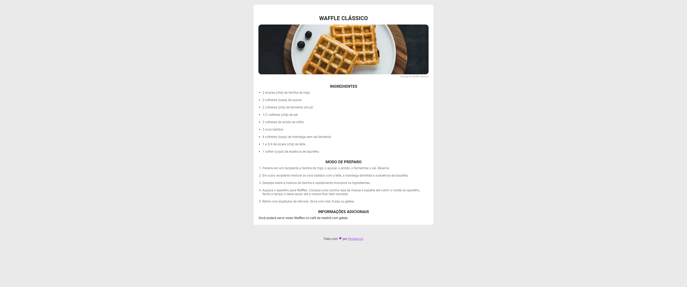

<h1 align="center"> Discover Wafle Recipe Page </h1>

	<a href="#-tecnologias">Tecnologias</a>&nbsp;&nbsp;&nbsp;|&nbsp;&nbsp;&nbsp;
	<a href="#memo-licença">Licença</a>

  

  

## 🚀 Tecnologias

Esse projeto foi desenvolvido com as seguintes tecnologias:

-   HTML e CSS

## 💻 Projeto

São apenas um agredado de alguns htmls simples.

-   [Acesse o projeto finalizado, online](https://ittosanzzo.github.io/DiscoverReceita/)

## :memo: Licença

Esse projeto está sob a licença MIT.

---

Feito com ♥ by IttoSanzzo :wave:
